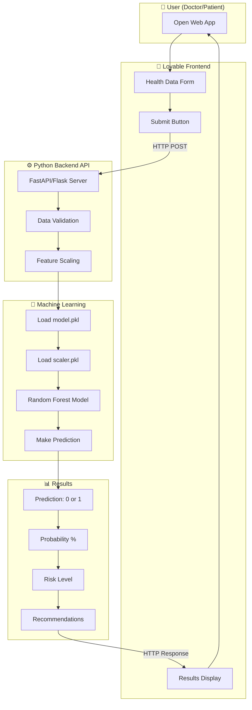
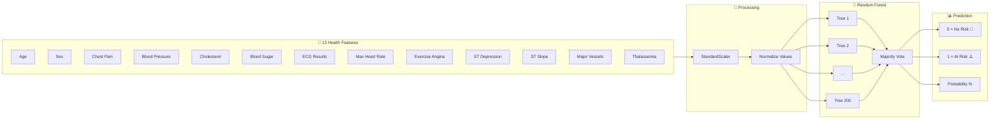
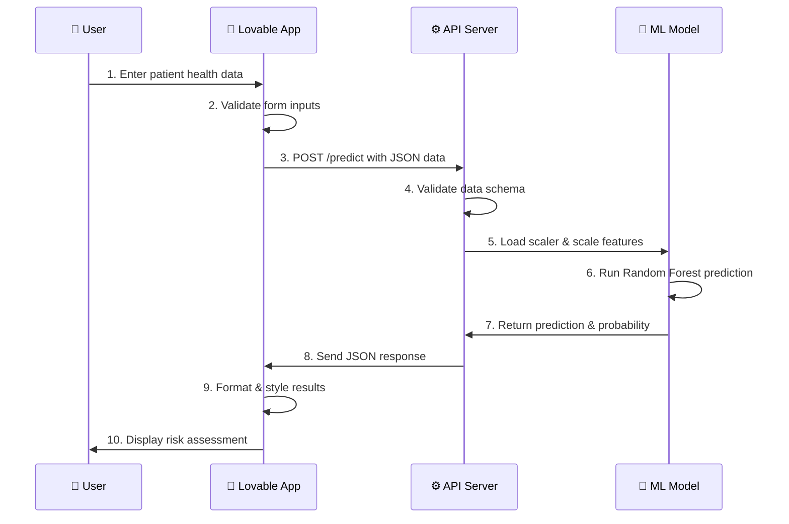
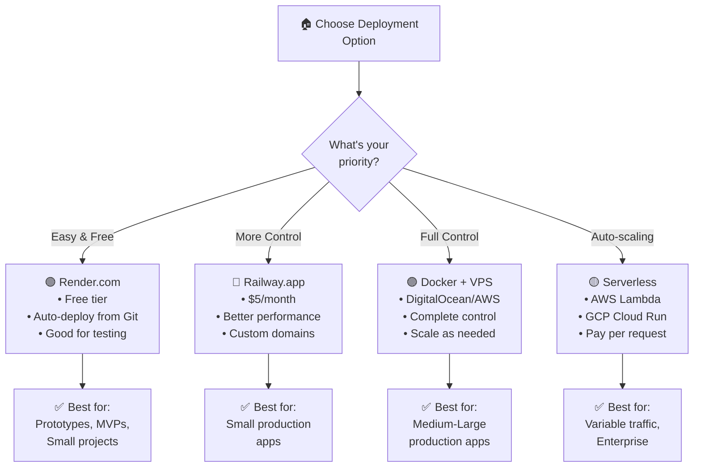
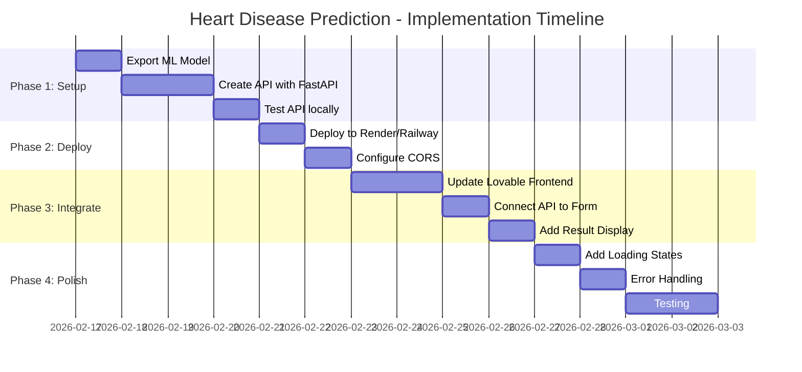

# 🫀 Heart Disease Prediction System - Complete Integration Guide

## 📖 Table of Contents

1. [What is This Project?](#-what-is-this-project)
2. [The Big Picture - How Everything Works Together](#-the-big-picture)
3. [Understanding the Heart Disease Model](#-understanding-the-heart-disease-model)
4. [System Architecture](#-system-architecture)
5. [Integration Options with Lovable](#-integration-options-with-lovable)
6. [Step-by-Step Implementation Guide](#-step-by-step-implementation-guide)
7. [API Reference](#-api-reference)
8. [Data Dictionary](#-data-dictionary)
9. [Deployment Options](#-deployment-options)
10. [Troubleshooting](#-troubleshooting)

---

## 🎯 What is This Project?

### Explained Like You're 5 Years Old 🧒

Imagine you have a magical crystal ball 🔮 that can look at information about someone (like their age, how fast their heart beats, and some numbers from a doctor's visit) and tell you if they might get a "heart boo-boo" in the future.

This project is that crystal ball! It's a computer program that:

1. **Listens** to information about a person
2. **Thinks** really hard using math (like a super-smart calculator)
3. **Tells you** if that person might be at risk for heart problems

### The Real Explanation 💼

This is a **Machine Learning Heart Disease Prediction System** that:

- Uses a **Random Forest** algorithm (a type of AI)
- Analyzes **13 health features** to predict heart disease risk
- Provides predictions with **~85% accuracy**
- Includes **explainable AI (LIME)** to understand why predictions are made

---

## 🖼️ The Big Picture

### How Everything Works Together



### Simple Text Diagram (In Case Mermaid Doesn't Render)

```
┌─────────────────────────────────────────────────────────────────────────────┐
│                        THE COMPLETE SYSTEM                                   │
├─────────────────────────────────────────────────────────────────────────────┤
│                                                                              │
│   ┌─────────────┐     ┌─────────────┐     ┌─────────────┐                   │
│   │   LOVABLE   │     │   BACKEND   │     │   ML MODEL  │                   │
│   │  FRONTEND   │────▶│   (API)     │────▶│   (Brain)   │                   │
│   │   (Face)    │◀────│   (Body)    │◀────│   (Heart)   │                   │
│   └─────────────┘     └─────────────┘     └─────────────┘                   │
│        ▲                   ▲                    ▲                            │
│        │                   │                    │                            │
│   User sees &         Carries data          Makes the                        │
│   interacts here      back & forth          prediction                       │
│                                                                              │
└─────────────────────────────────────────────────────────────────────────────┘
```

### Think of it Like a Restaurant 🍕

```
┌──────────────────────────────────────────────────────────────────┐
│                     THE RESTAURANT ANALOGY                        │
├──────────────────────────────────────────────────────────────────┤
│                                                                   │
│  LOVABLE APP = The Restaurant Front                              │
│  ┌────────────────────────────────────┐                          │
│  │  🪑 Tables, Menu, Waiters          │   ← Where you sit       │
│  │  📋 You tell the waiter what you   │     and order            │
│  │     want (enter health data)       │                          │
│  └────────────────────────────────────┘                          │
│                       │                                           │
│                       ▼                                           │
│  BACKEND API = The Waiter                                        │
│  ┌────────────────────────────────────┐                          │
│  │  🏃 Takes your order to kitchen    │   ← Carries info        │
│  │  🏃 Brings food back to you        │     back and forth       │
│  └────────────────────────────────────┘                          │
│                       │                                           │
│                       ▼                                           │
│  ML MODEL = The Chef                                             │
│  ┌────────────────────────────────────┐                          │
│  │  👨‍🍳 Reads the order               │   ← Does the actual     │
│  │  👨‍🍳 Cooks the meal (prediction)   │     work                 │
│  │  👨‍🍳 Sends it back                 │                          │
│  └────────────────────────────────────┘                          │
│                                                                   │
└──────────────────────────────────────────────────────────────────┘
```

---

## 🧠 Understanding the Heart Disease Model

### How the Model Processes Data



### What the Model Learned 📚

The model was trained on real patient data to recognize patterns that indicate heart disease risk.

```
┌─────────────────────────────────────────────────────────────────────────────┐
│                         MODEL TRAINING PROCESS                               │
├─────────────────────────────────────────────────────────────────────────────┤
│                                                                              │
│   STEP 1: COLLECT DATA                                                       │
│   ┌─────────────────────────────────────────────────────────┐               │
│   │  📊 Gathered health information from many patients       │               │
│   │  📊 Each patient had: age, blood pressure, cholesterol   │               │
│   │  📊 We also knew: did they have heart disease? (Yes/No)  │               │
│   └─────────────────────────────────────────────────────────┘               │
│                              │                                               │
│                              ▼                                               │
│   STEP 2: SPLIT DATA (80% Train, 20% Test)                                  │
│   ┌─────────────────────────────────────────────────────────┐               │
│   │  📚 80% = School (training data - model learns)          │               │
│   │  📝 20% = Exam (test data - check if model learned)      │               │
│   └─────────────────────────────────────────────────────────┘               │
│                              │                                               │
│                              ▼                                               │
│   STEP 3: TRAIN THE MODEL                                                    │
│   ┌─────────────────────────────────────────────────────────┐               │
│   │  🌲 Random Forest = 200 Decision Trees working together  │               │
│   │  🌲 Each tree looks at different patterns               │               │
│   │  🌲 They vote together for final answer                 │               │
│   └─────────────────────────────────────────────────────────┘               │
│                              │                                               │
│                              ▼                                               │
│   STEP 4: TEST & TUNE                                                        │
│   ┌─────────────────────────────────────────────────────────┐               │
│   │  ✅ Tested on unseen data                                │               │
│   │  🎛️  Tuned hyperparameters (n_estimators, max_depth)    │               │
│   │  📈 Achieved ~85% accuracy                               │               │
│   └─────────────────────────────────────────────────────────┘               │
│                                                                              │
└─────────────────────────────────────────────────────────────────────────────┘
```

### Random Forest Explained Like You're 5 🌲

```
┌─────────────────────────────────────────────────────────────────────────────┐
│                    RANDOM FOREST = VOTING TREES                              │
├─────────────────────────────────────────────────────────────────────────────┤
│                                                                              │
│  Imagine 200 trees in a forest, and each tree is a friend who helps you     │
│  decide if someone might have heart problems:                                │
│                                                                              │
│        🌲 Tree 1        🌲 Tree 2        🌲 Tree 3        ...  🌲 Tree 200   │
│           │                │                │                      │         │
│           ▼                ▼                ▼                      ▼         │
│        "Yes! ✓"        "No ✗"          "Yes! ✓"              "Yes! ✓"       │
│                                                                              │
│                              │                                               │
│                              ▼                                               │
│                    ┌──────────────────┐                                     │
│                    │   VOTE COUNTING  │                                     │
│                    │                  │                                     │
│                    │  Yes: 150 votes  │                                     │
│                    │  No:   50 votes  │                                     │
│                    │                  │                                     │
│                    │  WINNER: YES! ✓  │                                     │
│                    └──────────────────┘                                     │
│                                                                              │
│  The final answer = what MOST trees agree on (majority vote)                │
│                                                                              │
└─────────────────────────────────────────────────────────────────────────────┘
```

---

## 🏗️ System Architecture

### Option 1: Simple Architecture (Easiest to Build)

```
┌─────────────────────────────────────────────────────────────────────────────┐
│                      OPTION 1: SIMPLE ARCHITECTURE                           │
├─────────────────────────────────────────────────────────────────────────────┤
│                                                                              │
│  ┌────────────────┐        ┌────────────────┐        ┌────────────────┐     │
│  │   LOVABLE      │        │   FLASK API    │        │   MODEL.PKL    │     │
│  │   FRONTEND     │◀──────▶│   (Python)     │◀──────▶│   (Pickle)     │     │
│  │                │  HTTP  │                │        │                │     │
│  │  React/HTML    │        │  /api/predict  │        │  Random Forest │     │
│  └────────────────┘        └────────────────┘        └────────────────┘     │
│                                                                              │
│  PROS: ✅ Easy to build, ✅ Quick to deploy, ✅ Good for testing            │
│  CONS: ❌ Single server, ❌ No caching, ❌ Limited scaling                   │
│                                                                              │
└─────────────────────────────────────────────────────────────────────────────┘
```

### Option 2: Production Architecture (Recommended)

```
┌─────────────────────────────────────────────────────────────────────────────┐
│                   OPTION 2: PRODUCTION ARCHITECTURE                          │
├─────────────────────────────────────────────────────────────────────────────┤
│                                                                              │
│  USER                                                                        │
│    │                                                                         │
│    ▼                                                                         │
│  ┌──────────────────────────────────────┐                                   │
│  │           LOVABLE FRONTEND            │   ← React App (Vercel/Netlify)   │
│  │         (doctors.lovable.app)         │                                   │
│  └────────────────────┬─────────────────┘                                   │
│                       │ HTTPS                                                │
│                       ▼                                                      │
│  ┌──────────────────────────────────────┐                                   │
│  │          API GATEWAY / NGINX          │   ← Load Balancer                │
│  └────────────────────┬─────────────────┘                                   │
│                       │                                                      │
│           ┌───────────┴───────────┐                                         │
│           ▼                       ▼                                          │
│  ┌──────────────────┐   ┌──────────────────┐                                │
│  │   API Server 1   │   │   API Server 2   │   ← Multiple instances        │
│  │   (FastAPI)      │   │   (FastAPI)      │      for high traffic          │
│  └────────┬─────────┘   └────────┬─────────┘                                │
│           │                       │                                          │
│           └───────────┬───────────┘                                         │
│                       ▼                                                      │
│  ┌──────────────────────────────────────┐                                   │
│  │              REDIS CACHE              │   ← Cache predictions            │
│  └────────────────────┬─────────────────┘                                   │
│                       │                                                      │
│                       ▼                                                      │
│  ┌──────────────────────────────────────┐                                   │
│  │      ML MODEL SERVICE (Docker)        │   ← Isolated model container     │
│  │         - model.pkl                   │                                   │
│  │         - scaler.pkl                  │                                   │
│  └──────────────────────────────────────┘                                   │
│                                                                              │
└─────────────────────────────────────────────────────────────────────────────┘
```

### Option 3: Serverless Architecture (Cloud-Native)

```
┌─────────────────────────────────────────────────────────────────────────────┐
│                    OPTION 3: SERVERLESS ARCHITECTURE                         │
├─────────────────────────────────────────────────────────────────────────────┤
│                                                                              │
│  ┌─────────────┐     ┌─────────────────┐     ┌──────────────────────┐       │
│  │   LOVABLE   │────▶│  AWS API        │────▶│  AWS Lambda / GCP     │       │
│  │   APP       │     │  Gateway        │     │  Cloud Functions      │       │
│  └─────────────┘     └─────────────────┘     └──────────┬───────────┘       │
│                                                          │                   │
│                                                          ▼                   │
│                                               ┌──────────────────────┐       │
│                                               │  Model stored in      │       │
│                                               │  S3 / Cloud Storage   │       │
│                                               └──────────────────────┘       │
│                                                                              │
│  PROS: ✅ Auto-scaling, ✅ Pay-per-use, ✅ No server management              │
│  CONS: ❌ Cold starts, ❌ More complex setup, ❌ Cloud vendor lock-in        │
│                                                                              │
└─────────────────────────────────────────────────────────────────────────────┘
```

---

## 🔗 Integration Options with Lovable

### Request Flow Diagram



### Option A: REST API Integration (Most Common)

```
┌─────────────────────────────────────────────────────────────────────────────┐
│                    OPTION A: REST API INTEGRATION                            │
├─────────────────────────────────────────────────────────────────────────────┤
│                                                                              │
│  HOW IT WORKS:                                                               │
│                                                                              │
│  1. User fills form in Lovable app                                          │
│     ┌────────────────────────────────────────┐                              │
│     │  Age: [63]  Sex: [Male]  BP: [145]     │                              │
│     │  Cholesterol: [233]  ...               │                              │
│     │                                         │                              │
│     │        [Predict Heart Risk]            │                              │
│     └────────────────────────────────────────┘                              │
│                         │                                                    │
│                         ▼                                                    │
│  2. Lovable sends HTTP POST request                                         │
│     ┌────────────────────────────────────────┐                              │
│     │  POST https://api.yoursite.com/predict │                              │
│     │  {                                     │                              │
│     │    "age": 63,                          │                              │
│     │    "sex": 1,                           │                              │
│     │    "cp": 3,                            │                              │
│     │    ...                                 │                              │
│     │  }                                     │                              │
│     └────────────────────────────────────────┘                              │
│                         │                                                    │
│                         ▼                                                    │
│  3. API returns prediction                                                   │
│     ┌────────────────────────────────────────┐                              │
│     │  {                                     │                              │
│     │    "prediction": 1,                    │                              │
│     │    "risk_level": "High",               │                              │
│     │    "probability": 0.78,                │                              │
│     │    "message": "At risk of heart..."    │                              │
│     │  }                                     │                              │
│     └────────────────────────────────────────┘                              │
│                         │                                                    │
│                         ▼                                                    │
│  4. Lovable displays result                                                  │
│     ┌────────────────────────────────────────┐                              │
│     │  ⚠️ HIGH RISK                           │                              │
│     │  There is a 78% chance of heart        │                              │
│     │  disease. Please consult a doctor.     │                              │
│     └────────────────────────────────────────┘                              │
│                                                                              │
└─────────────────────────────────────────────────────────────────────────────┘
```

### Option B: Embedded Model (Model Runs in Browser)

```
┌─────────────────────────────────────────────────────────────────────────────┐
│                    OPTION B: EMBEDDED MODEL (ONNX/TensorFlow.js)             │
├─────────────────────────────────────────────────────────────────────────────┤
│                                                                              │
│  ┌──────────────────────────────────────────────────────────────────────┐   │
│  │                        LOVABLE FRONTEND                               │   │
│  │  ┌─────────────────┐      ┌─────────────────────────────────────┐   │   │
│  │  │   User Input    │─────▶│   TensorFlow.js / ONNX.js Model     │   │   │
│  │  │   Form          │      │   (runs directly in browser!)       │   │   │
│  │  └─────────────────┘      └─────────────────────────────────────┘   │   │
│  │                                          │                           │   │
│  │                                          ▼                           │   │
│  │                              ┌─────────────────────┐                │   │
│  │                              │   Display Results   │                │   │
│  │                              └─────────────────────┘                │   │
│  └──────────────────────────────────────────────────────────────────────┘   │
│                                                                              │
│  PROS: ✅ No server needed, ✅ Very fast, ✅ Works offline                   │
│  CONS: ❌ Larger JavaScript bundle, ❌ Need to convert model, ❌ Limited ML  │
│                                                                              │
└─────────────────────────────────────────────────────────────────────────────┘
```

### Option C: Hybrid (Supabase Edge Functions)

```
┌─────────────────────────────────────────────────────────────────────────────┐
│                    OPTION C: SUPABASE EDGE FUNCTIONS                         │
├─────────────────────────────────────────────────────────────────────────────┤
│                                                                              │
│  ┌────────────────┐                                                         │
│  │   LOVABLE      │                                                         │
│  │   FRONTEND     │                                                         │
│  └───────┬────────┘                                                         │
│          │ Call Supabase Function                                           │
│          ▼                                                                   │
│  ┌─────────────────────────────────────────────────────────────┐            │
│  │                    SUPABASE                                  │            │
│  │  ┌─────────────────┐    ┌────────────────────────────────┐  │            │
│  │  │  Edge Function  │───▶│  Python Runtime / Docker        │  │            │
│  │  │  (Deno/Node)    │    │  with ML Model                  │  │            │
│  │  └─────────────────┘    └────────────────────────────────┘  │            │
│  │                                                              │            │
│  │  ┌─────────────────────────────────────────────────────┐    │            │
│  │  │  Also: Store predictions in Supabase Database       │    │            │
│  │  │  - Track patient history                            │    │            │
│  │  │  - Analytics dashboard                              │    │            │
│  │  └─────────────────────────────────────────────────────┘    │            │
│  └─────────────────────────────────────────────────────────────┘            │
│                                                                              │
└─────────────────────────────────────────────────────────────────────────────┘
```

---

## 🚀 Step-by-Step Implementation Guide

### Step 1: Export and Save the Model

```python
# save_model.py - Run this in your Jupyter notebook or Python script

import pickle
from sklearn.preprocessing import StandardScaler
from sklearn.ensemble import RandomForestClassifier

# After training your model (rf_model) and scaler:

# Save the model
with open('model.pkl', 'wb') as f:
    pickle.dump(rf_model, f)

# Save the scaler (IMPORTANT - needed for preprocessing)
with open('scaler.pkl', 'wb') as f:
    pickle.dump(scaler, f)

print("✅ Model and scaler saved successfully!")
```

### Step 2: Create the Backend API

#### Option A: Flask (Simpler)

```python
# app.py - Flask Backend

from flask import Flask, request, jsonify
from flask_cors import CORS
import pickle
import numpy as np

app = Flask(__name__)
CORS(app)  # Allow requests from Lovable frontend

# Load model and scaler
model = pickle.load(open('model.pkl', 'rb'))
scaler = pickle.load(open('scaler.pkl', 'rb'))

# Feature names (in order!)
FEATURE_NAMES = [
    'age', 'sex', 'cp', 'trestbps', 'chol', 'fbs',
    'restecg', 'thalach', 'exang', 'oldpeak', 'slope', 'ca', 'thal'
]

@app.route('/predict', methods=['POST'])
def predict():
    try:
        # Get data from request
        data = request.json

        # Extract features in correct order
        features = [data[name] for name in FEATURE_NAMES]
        features_array = np.array([features])

        # Scale features
        features_scaled = scaler.transform(features_array)

        # Make prediction
        prediction = model.predict(features_scaled)[0]
        probability = model.predict_proba(features_scaled)[0][1]

        # Prepare response
        result = {
            'prediction': int(prediction),
            'probability': float(probability),
            'risk_level': 'High' if prediction == 1 else 'Low',
            'message': get_message(prediction, probability)
        }

        return jsonify(result)

    except Exception as e:
        return jsonify({'error': str(e)}), 400

def get_message(prediction, probability):
    if prediction == 1:
        if probability > 0.8:
            return "🚨 Very High Risk: Immediate medical consultation recommended."
        elif probability > 0.6:
            return "⚠️ High Risk: Please schedule a doctor's appointment soon."
        else:
            return "⚡ Moderate-High Risk: Consider lifestyle changes and monitoring."
    else:
        if probability < 0.2:
            return "💚 Very Low Risk: Keep up the healthy lifestyle!"
        else:
            return "💙 Low Risk: Continue regular check-ups."

if __name__ == '__main__':
    app.run(host='0.0.0.0', port=5000, debug=True)
```

#### Option B: FastAPI (Better for Production)

```python
# main.py - FastAPI Backend

from fastapi import FastAPI, HTTPException
from fastapi.middleware.cors import CORSMiddleware
from pydantic import BaseModel, Field
import pickle
import numpy as np

app = FastAPI(
    title="Heart Disease Prediction API",
    description="Predict heart disease risk using ML",
    version="1.0.0"
)

# Enable CORS for Lovable
app.add_middleware(
    CORSMiddleware,
    allow_origins=["*"],  # Replace with your Lovable URL in production
    allow_credentials=True,
    allow_methods=["*"],
    allow_headers=["*"],
)

# Load model and scaler
model = pickle.load(open('model.pkl', 'rb'))
scaler = pickle.load(open('scaler.pkl', 'rb'))

class PatientData(BaseModel):
    age: int = Field(..., ge=0, le=120, description="Patient's age")
    sex: int = Field(..., ge=0, le=1, description="Sex (0=Female, 1=Male)")
    cp: int = Field(..., ge=0, le=3, description="Chest pain type (0-3)")
    trestbps: int = Field(..., ge=0, description="Resting blood pressure")
    chol: int = Field(..., ge=0, description="Serum cholesterol in mg/dl")
    fbs: int = Field(..., ge=0, le=1, description="Fasting blood sugar > 120mg/dl")
    restecg: int = Field(..., ge=0, le=2, description="Resting ECG results")
    thalach: int = Field(..., ge=0, description="Maximum heart rate achieved")
    exang: int = Field(..., ge=0, le=1, description="Exercise induced angina")
    oldpeak: float = Field(..., ge=0, description="ST depression")
    slope: int = Field(..., ge=0, le=2, description="Slope of peak exercise ST")
    ca: int = Field(..., ge=0, le=4, description="Number of major vessels")
    thal: int = Field(..., ge=0, le=3, description="Thalassemia type")

class PredictionResult(BaseModel):
    prediction: int
    probability: float
    risk_level: str
    message: str
    confidence: str

@app.post("/predict", response_model=PredictionResult)
def predict(patient: PatientData):
    features = np.array([[
        patient.age, patient.sex, patient.cp, patient.trestbps,
        patient.chol, patient.fbs, patient.restecg, patient.thalach,
        patient.exang, patient.oldpeak, patient.slope, patient.ca, patient.thal
    ]])

    features_scaled = scaler.transform(features)
    prediction = model.predict(features_scaled)[0]
    probability = model.predict_proba(features_scaled)[0][1]

    return PredictionResult(
        prediction=int(prediction),
        probability=round(float(probability), 4),
        risk_level="High Risk" if prediction == 1 else "Low Risk",
        message=get_message(prediction, probability),
        confidence=f"{max(probability, 1-probability)*100:.1f}%"
    )

@app.get("/health")
def health_check():
    return {"status": "healthy", "model_loaded": True}
```

### Step 3: Update Lovable Frontend

Add this code to your Lovable app to call the API:

```typescript
// services/heartPrediction.ts

interface PatientData {
  age: number;
  sex: number;
  cp: number;
  trestbps: number;
  chol: number;
  fbs: number;
  restecg: number;
  thalach: number;
  exang: number;
  oldpeak: number;
  slope: number;
  ca: number;
  thal: number;
}

interface PredictionResult {
  prediction: number;
  probability: number;
  risk_level: string;
  message: string;
  confidence: string;
}

const API_URL = process.env.VITE_API_URL || "https://your-api-server.com";

export async function predictHeartDisease(
  patientData: PatientData,
): Promise<PredictionResult> {
  const response = await fetch(`${API_URL}/predict`, {
    method: "POST",
    headers: {
      "Content-Type": "application/json",
    },
    body: JSON.stringify(patientData),
  });

  if (!response.ok) {
    throw new Error("Prediction failed");
  }

  return response.json();
}
```

```tsx
// components/PredictionForm.tsx

import { useState } from "react";
import { predictHeartDisease } from "../services/heartPrediction";

export function PredictionForm() {
  const [formData, setFormData] = useState({
    age: 50,
    sex: 1,
    cp: 0,
    trestbps: 120,
    chol: 200,
    fbs: 0,
    restecg: 0,
    thalach: 150,
    exang: 0,
    oldpeak: 0,
    slope: 0,
    ca: 0,
    thal: 1,
  });

  const [result, setResult] = useState(null);
  const [loading, setLoading] = useState(false);

  const handleSubmit = async (e) => {
    e.preventDefault();
    setLoading(true);

    try {
      const prediction = await predictHeartDisease(formData);
      setResult(prediction);
    } catch (error) {
      console.error("Error:", error);
    } finally {
      setLoading(false);
    }
  };

  return (
    <div className="max-w-2xl mx-auto p-6 bg-white rounded-lg shadow-lg">
      <h2 className="text-2xl font-bold mb-6 text-center">
        🫀 Heart Disease Risk Assessment
      </h2>

      <form onSubmit={handleSubmit} className="space-y-4">
        {/* Form fields here */}
        <div className="grid grid-cols-2 gap-4">
          <div>
            <label className="block text-sm font-medium mb-1">Age</label>
            <input
              type="number"
              value={formData.age}
              onChange={(e) =>
                setFormData({ ...formData, age: +e.target.value })
              }
              className="w-full p-2 border rounded"
            />
          </div>
          {/* Add more fields... */}
        </div>

        <button
          type="submit"
          disabled={loading}
          className="w-full bg-blue-600 text-white py-3 rounded-lg font-semibold
                     hover:bg-blue-700 disabled:opacity-50"
        >
          {loading ? "🔄 Analyzing..." : "🔍 Predict Heart Risk"}
        </button>
      </form>

      {result && (
        <div
          className={`mt-6 p-4 rounded-lg ${
            result.prediction === 1 ? "bg-red-100" : "bg-green-100"
          }`}
        >
          <h3 className="text-xl font-bold mb-2">{result.risk_level}</h3>
          <p>Probability: {(result.probability * 100).toFixed(1)}%</p>
          <p>{result.message}</p>
        </div>
      )}
    </div>
  );
}
```

### Step 4: Deploy the Backend

#### Option A: Deploy to Render.com (Free & Easy)

```yaml
# render.yaml
services:
  - type: web
    name: heart-disease-api
    env: python
    buildCommand: pip install -r requirements.txt
    startCommand: uvicorn main:app --host 0.0.0.0 --port $PORT
```

```
# requirements.txt
fastapi==0.104.1
uvicorn==0.24.0
scikit-learn==1.3.2
numpy==1.26.2
pydantic==2.5.2
python-multipart==0.0.6
```

#### Option B: Deploy with Docker

```dockerfile
# Dockerfile
FROM python:3.11-slim

WORKDIR /app

COPY requirements.txt .
RUN pip install --no-cache-dir -r requirements.txt

COPY model.pkl scaler.pkl main.py ./

EXPOSE 8000

CMD ["uvicorn", "main:app", "--host", "0.0.0.0", "--port", "8000"]
```

```bash
# Build and run
docker build -t heart-disease-api .
docker run -p 8000:8000 heart-disease-api
```

---

## 📚 API Reference

### POST /predict

Predicts heart disease risk based on patient data.

#### Request Body

```json
{
  "age": 63,
  "sex": 1,
  "cp": 3,
  "trestbps": 145,
  "chol": 233,
  "fbs": 1,
  "restecg": 0,
  "thalach": 150,
  "exang": 0,
  "oldpeak": 2.3,
  "slope": 0,
  "ca": 0,
  "thal": 1
}
```

#### Response

```json
{
  "prediction": 1,
  "probability": 0.78,
  "risk_level": "High Risk",
  "message": "⚠️ High Risk: Please schedule a doctor's appointment soon.",
  "confidence": "78.0%"
}
```

### GET /health

Health check endpoint.

#### Response

```json
{
  "status": "healthy",
  "model_loaded": true
}
```

---

## 📊 Data Dictionary

### All 13 Features Explained (Like You're 5!)

```
┌─────────────────────────────────────────────────────────────────────────────┐
│                        DATA DICTIONARY - SIMPLE EXPLANATIONS                 │
├─────────────────────────────────────────────────────────────────────────────┤
│                                                                              │
│  1. AGE 👶➡️👴                                                               │
│     ├─ What it is: How old the person is                                    │
│     ├─ Example: 63 years old                                                │
│     └─ Why it matters: Older people have higher risk                        │
│                                                                              │
│  2. SEX 👨👩                                                                 │
│     ├─ What it is: Boy (1) or Girl (0)                                      │
│     ├─ Values: 0 = Female, 1 = Male                                         │
│     └─ Why it matters: Men have slightly higher risk                        │
│                                                                              │
│  3. CP (Chest Pain Type) 💔                                                 │
│     ├─ What it is: Type of "ouch" feeling in chest                          │
│     ├─ Values:                                                              │
│     │   0 = Typical angina (heart-related chest pain)                       │
│     │   1 = Atypical angina (unusual chest pain)                            │
│     │   2 = Non-anginal pain (not heart-related)                            │
│     │   3 = Asymptomatic (no pain at all! but still risky)                  │
│     └─ Why it matters: Different pain types = different risks               │
│                                                                              │
│  4. TRESTBPS (Resting Blood Pressure) 🩺                                    │
│     ├─ What it is: How hard blood pushes when you're resting                │
│     ├─ Example: 145 mm Hg                                                   │
│     ├─ Normal: 90-120 is healthy                                            │
│     └─ Why it matters: High pressure = heart works too hard                 │
│                                                                              │
│  5. CHOL (Cholesterol) 🧈                                                   │
│     ├─ What it is: Amount of "fatty stuff" in blood                         │
│     ├─ Example: 233 mg/dl                                                   │
│     ├─ Normal: Under 200 is healthy                                         │
│     └─ Why it matters: Too much = arteries get clogged                      │
│                                                                              │
│  6. FBS (Fasting Blood Sugar) 🍬                                            │
│     ├─ What it is: Sugar in blood before breakfast                          │
│     ├─ Values: 0 = Normal (< 120), 1 = High (> 120 mg/dl)                   │
│     └─ Why it matters: High sugar can damage heart                          │
│                                                                              │
│  7. RESTECG (Resting ECG Results) 📈                                        │
│     ├─ What it is: Heart's "drawing" when resting                           │
│     ├─ Values:                                                              │
│     │   0 = Normal (everything looks good!)                                 │
│     │   1 = ST-T wave abnormality (small problem in drawing)                │
│     │   2 = Left ventricular hypertrophy (heart muscle too thick)           │
│     └─ Why it matters: Shows if heart has problems                          │
│                                                                              │
│  8. THALACH (Max Heart Rate) 💓⚡                                           │
│     ├─ What it is: Fastest heartbeat during exercise                        │
│     ├─ Example: 150 beats per minute                                        │
│     ├─ Normal max: 220 minus your age                                       │
│     └─ Why it matters: Low max rate = heart might be struggling             │
│                                                                              │
│  9. EXANG (Exercise Induced Angina) 🏃💔                                    │
│     ├─ What it is: Does exercise cause chest pain?                          │
│     ├─ Values: 0 = No pain when exercising, 1 = Pain when exercising        │
│     └─ Why it matters: Pain during exercise = heart not getting enough      │
│                                                                              │
│  10. OLDPEAK (ST Depression) 📉                                             │
│      ├─ What it is: How much the heart's "line" drops during exercise       │
│      ├─ Example: 2.3                                                        │
│      └─ Why it matters: More drop = less blood flow to heart                │
│                                                                              │
│  11. SLOPE (ST Slope) ⛷️                                                    │
│      ├─ What it is: Direction of the heart line after exercise              │
│      ├─ Values:                                                             │
│      │   0 = Upsloping (going up - usually good!)                           │
│      │   1 = Flat (staying same - not great)                                │
│      │   2 = Downsloping (going down - concerning)                          │
│      └─ Why it matters: Shows how heart recovers after exercise             │
│                                                                              │
│  12. CA (Number of Major Vessels) 🩸                                        │
│      ├─ What it is: How many big blood tubes are colored in X-ray           │
│      ├─ Values: 0, 1, 2, 3, or 4                                            │
│      └─ Why it matters: More colored tubes = better blood flow              │
│                                                                              │
│  13. THAL (Thalassemia) 🩸🧬                                                │
│      ├─ What it is: Type of blood test result                               │
│      ├─ Values:                                                             │
│      │   0 = Normal                                                         │
│      │   1 = Fixed defect (permanent problem)                               │
│      │   2 = Reversible defect (temporary problem)                          │
│      │   3 = Unknown                                                        │
│      └─ Why it matters: Defects affect heart's blood supply                 │
│                                                                              │
└─────────────────────────────────────────────────────────────────────────────┘
```

---

## 🎯 Deployment Options

### Deployment Decision Tree



### Comparison Chart

```
┌────────────────────┬───────────────────┬────────────────┬───────────────────┐
│     Platform       │       Cost        │   Difficulty   │    Best For       │
├────────────────────┼───────────────────┼────────────────┼───────────────────┤
│  Render.com        │  Free tier        │  ⭐ Easy       │  MVP, Testing     │
│  Railway.app       │  $5/month         │  ⭐ Easy       │  Small projects   │
│  Heroku            │  $5-25/month      │  ⭐⭐ Medium   │  Small-Medium     │
│  DigitalOcean      │  $5-20/month      │  ⭐⭐ Medium   │  Medium projects  │
│  AWS Lambda        │  Pay per use      │  ⭐⭐⭐ Hard   │  Variable traffic │
│  GCP Cloud Run     │  Pay per use      │  ⭐⭐⭐ Hard   │  Variable traffic │
│  Azure Functions   │  Pay per use      │  ⭐⭐⭐ Hard   │  Enterprise       │
└────────────────────┴───────────────────┴────────────────┴───────────────────┘
```

### Quick Deploy: Render.com

```bash
# 1. Create these files in a GitHub repo:

# requirements.txt
fastapi==0.104.1
uvicorn==0.24.0
scikit-learn==1.3.2
numpy==1.26.2

# 2. Go to render.com
# 3. Click "New Web Service"
# 4. Connect your GitHub repo
# 5. Set:
#    - Build Command: pip install -r requirements.txt
#    - Start Command: uvicorn main:app --host 0.0.0.0 --port $PORT
# 6. Click "Create Web Service"
# 7. Copy the URL (e.g., https://your-app.onrender.com)
# 8. Use this URL in your Lovable app!
```

---

## 🛠️ Complete Project Structure

```
heart-disease-prediction/
├── 📁 backend/                    # API Server
│   ├── 📄 main.py                 # FastAPI application
│   ├── 📄 model.pkl               # Trained ML model
│   ├── 📄 scaler.pkl              # Data scaler
│   ├── 📄 requirements.txt        # Python dependencies
│   ├── 📄 Dockerfile              # Container config
│   └── 📄 render.yaml             # Render deployment config
│
├── 📁 frontend/                   # Lovable App (Generated)
│   ├── 📁 src/
│   │   ├── 📁 components/
│   │   │   ├── 📄 PredictionForm.tsx
│   │   │   └── 📄 ResultDisplay.tsx
│   │   ├── 📁 services/
│   │   │   └── 📄 heartPrediction.ts
│   │   └── 📄 App.tsx
│   └── 📄 package.json
│
├── 📁 notebooks/                  # ML Development
│   ├── 📄 PIM_Finale.ipynb        # Training notebook
│   └── 📄 data_exploration.ipynb  # EDA notebook
│
├── 📁 data/                       # Datasets
│   ├── 📄 trainTest.csv           # Training data
│   └── 📄 validation.csv          # Validation data
│
└── 📄 README.md                   # This file!
```

---

## 🔧 Troubleshooting

### Common Issues and Solutions

```
┌─────────────────────────────────────────────────────────────────────────────┐
│                           TROUBLESHOOTING GUIDE                              │
├─────────────────────────────────────────────────────────────────────────────┤
│                                                                              │
│  ❌ PROBLEM: CORS Error (Request blocked by browser)                        │
│  ✅ SOLUTION: Make sure CORS is enabled in your backend:                    │
│     from fastapi.middleware.cors import CORSMiddleware                      │
│     app.add_middleware(CORSMiddleware, allow_origins=["*"])                 │
│                                                                              │
│  ───────────────────────────────────────────────────────────────────────── │
│                                                                              │
│  ❌ PROBLEM: Model not loading ("No module named sklearn")                   │
│  ✅ SOLUTION: Make sure scikit-learn version matches:                       │
│     pip install scikit-learn==1.3.2  (same as training environment)         │
│                                                                              │
│  ───────────────────────────────────────────────────────────────────────── │
│                                                                              │
│  ❌ PROBLEM: Predictions are always wrong                                    │
│  ✅ SOLUTION: Check feature order! Features MUST be in exact same order     │
│     as during training. Use this order:                                     │
│     [age, sex, cp, trestbps, chol, fbs, restecg, thalach,                   │
│      exang, oldpeak, slope, ca, thal]                                       │
│                                                                              │
│  ───────────────────────────────────────────────────────────────────────── │
│                                                                              │
│  ❌ PROBLEM: API is slow / timing out                                        │
│  ✅ SOLUTION: Add timeout handling in frontend:                             │
│     const controller = new AbortController();                               │
│     setTimeout(() => controller.abort(), 10000);                            │
│     fetch(url, { signal: controller.signal })                               │
│                                                                              │
│  ───────────────────────────────────────────────────────────────────────── │
│                                                                              │
│  ❌ PROBLEM: Scaler not found                                                │
│  ✅ SOLUTION: Always save AND load the scaler with the model:               │
│     pickle.dump(scaler, open('scaler.pkl', 'wb'))                           │
│     scaler = pickle.load(open('scaler.pkl', 'rb'))                          │
│                                                                              │
└─────────────────────────────────────────────────────────────────────────────┘
```

---

## 📈 Next Steps & Enhancements

### Implementation Timeline



### Future Improvements

```
┌─────────────────────────────────────────────────────────────────────────────┐
│                           FUTURE ENHANCEMENTS                                │
├─────────────────────────────────────────────────────────────────────────────┤
│                                                                              │
│  🎯 PHASE 1: Basic Integration                                              │
│     □ Deploy API to cloud                                                   │
│     □ Connect Lovable frontend to API                                       │
│     □ Basic form with all 13 features                                       │
│     □ Display prediction results                                            │
│                                                                              │
│  🎯 PHASE 2: User Experience                                                │
│     □ Add input validation                                                  │
│     □ Show confidence levels                                                │
│     □ Add loading animations                                                │
│     □ Mobile-responsive design                                              │
│                                                                              │
│  🎯 PHASE 3: Advanced Features                                              │
│     □ Explainable AI (LIME) integration                                     │
│     □ Show which features influenced prediction                             │
│     □ Historical tracking for patients                                      │
│     □ PDF report generation                                                 │
│                                                                              │
│  🎯 PHASE 4: Enterprise                                                     │
│     □ User authentication                                                   │
│     □ Role-based access (Doctor, Admin)                                     │
│     □ Audit logging                                                         │
│     □ HIPAA compliance features                                             │
│                                                                              │
└─────────────────────────────────────────────────────────────────────────────┘
```

---

## 📞 Support & Resources

- **Model Training Notebook**: [PIM*Finale*(1).ipynb](<./PIM_Finale_(1).ipynb>)
- **FastAPI Documentation**: https://fastapi.tiangolo.com/
- **Lovable Documentation**: https://docs.lovable.dev/
- **Scikit-learn Documentation**: https://scikit-learn.org/

---

## 📜 License

This project is for educational and research purposes. Always consult with healthcare professionals for medical decisions.

---

_Made with ❤️ for heart health awareness_
